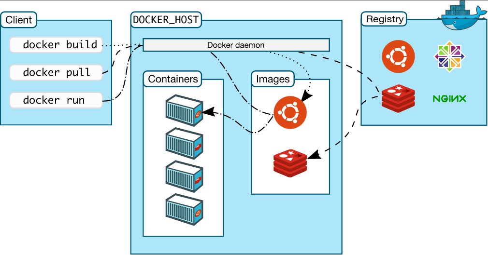
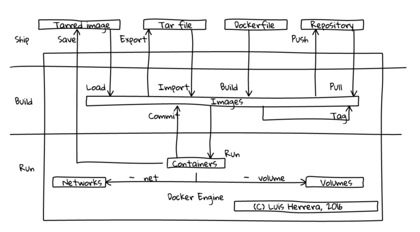

#  Docker Tutorial
#### Docker Tutorial for Beginner

## [Website docker](https://docs.docker.com/)
## Docker architecture (C) Docker Inc.


## Docker component interaction ( (C) Luis Herrera Benítez )



## Docker CLI ( [url](https://docs.docker.com/engine/reference/run/) )

#### Docker managing image
``` powershell
 docker image ls
 docker images
 
 Usage:  docker image COMMAND
 Commands:
  build       Build an image from a Dockerfile
  history     Show the history of an image
  import      Import the contents from a tarball to create a filesystem image
  inspect     Display detailed information on one or more images
  load        Load an image from a tar archive or STDIN
  ls          List images
  prune       Remove unused images
  pull        Pull an image or a repository from a registry
  push        Push an image or a repository to a registry
  rm          Remove one or more images
  save        Save one or more images to a tar archive (streamed to STDOUT by default)
  tag         Create a tag TARGET_IMAGE that refers to SOURCE_IMAGE

Run 'docker image COMMAND --help' for more information on a command.
```

#### Docker managing container

``` powershell
 docker ps
 docker images
 
Usage:  docker container COMMAND

Manage containers

Commands:
  attach      Attach local standard input, output, and error streams to a running container
  commit      Create a new image from a container's changes
  cp          Copy files/folders between a container and the local filesystem
  create      Create a new container
  diff        Inspect changes to files or directories on a container's filesystem
  exec        Run a command in a running container
  export      Export a container's filesystem as a tar archive
  inspect     Display detailed information on one or more containers
  kill        Kill one or more running containers
  logs        Fetch the logs of a container
  ls          List containers
  pause       Pause all processes within one or more containers
  port        List port mappings or a specific mapping for the container
  prune       Remove all stopped containers
  rename      Rename a container
  restart     Restart one or more containers
  rm          Remove one or more containers
  run         Run a command in a new container
  start       Start one or more stopped containers
  stats       Display a live stream of container(s) resource usage statistics
  stop        Stop one or more running containers
  top         Display the running processes of a container
  unpause     Unpause all processes within one or more containers
  update      Update configuration of one or more containers
  wait        Block until one or more containers stop, then print their exit codes

Run 'docker container COMMAND --help' for more information on a command.
```

#### Docker pull
``` powershell
 docker pull [OPTIONS] NAME[:TAG|@DIGEST]
 
 Pull an image or a repository from a registry

Options:
  -a, --all-tags                Download all tagged images in the repository
      --disable-content-trust   Skip image verification (default true)
      --platform string         Set platform if server is multi-platform
                                capable
  -q, --quiet                   Suppress verbose output
  
 # example redis
 docker pull redis
 docker pull redis:latest
 docker pull redis:4.0
```


#### Architecture Docker pull
```powershell
TERMINAL =====> DOCKER CLI =====> DOCKER HOST ( DOCKER DAEMON ) === CHECK CACHE NO ===>  DOCKER HUB ( Registry ) === 
                                                               ||                                                 ||
                                                               ||                                                 ||
                                                         CHECK CACHE YES                                          ||
                                                               ||                                                 ||
                                                               ||==========================================  DOCKER IMAGE ( DISK )
                                                                                                                  ||
                                                                                                                  ||
                                                                                                            BUILD CONTAINER ( DOCKER DAEMON check cache )
                                                                                                                  ||
                                                                                                                  ||
                                                                                                            DOCKER CONTAINER
```

#### Docker run
``` powershell
 Usage:  docker run [OPTIONS] IMAGE [COMMAND] [ARG...]

Run a command in a new container

Options:
      --add-host list                  Add a custom host-to-IP mapping
                                       (host:ip)
  -a, --attach list                    Attach to STDIN, STDOUT or STDERR
      --blkio-weight uint16            Block IO (relative weight),
                                       between 10 and 1000, or 0 to
                                       disable (default 0)
      --blkio-weight-device list       Block IO weight (relative device
                                       weight) (default [])
      --cap-add list                   Add Linux capabilities
      --cap-drop list                  Drop Linux capabilities
      --cgroup-parent string           Optional parent cgroup for the
                                       container
      --cgroupns string                Cgroup namespace to use
                                       (host|private)
                                       'host':    Run the container in
                                       the Docker host's cgroup namespace
                                       'private': Run the container in
                                       its own private cgroup namespace
                                       '':        Use the cgroup
                                       namespace as configured by the
                                                  default-cgroupns-mode
                                       option on the daemon (default)
      --cidfile string                 Write the container ID to the file
      --cpu-period int                 Limit CPU CFS (Completely Fair
                                       Scheduler) period
      --cpu-quota int                  Limit CPU CFS (Completely Fair
                                       Scheduler) quota
      --cpu-rt-period int              Limit CPU real-time period in
                                       microseconds
      --cpu-rt-runtime int             Limit CPU real-time runtime in
                                       microseconds
  -c, --cpu-shares int                 CPU shares (relative weight)
      --cpus decimal                   Number of CPUs
      --cpuset-cpus string             CPUs in which to allow execution
                                       (0-3, 0,1)
      --cpuset-mems string             MEMs in which to allow execution
                                       (0-3, 0,1)
  -d, --detach                         Run container in background and
                                       print container ID
      --detach-keys string             Override the key sequence for
                                       detaching a container
      --device list                    Add a host device to the container
      --device-cgroup-rule list        Add a rule to the cgroup allowed
                                       devices list
      --device-read-bps list           Limit read rate (bytes per second)
                                       from a device (default [])
      --device-read-iops list          Limit read rate (IO per second)
                                       from a device (default [])
      --device-write-bps list          Limit write rate (bytes per
                                       second) to a device (default [])
      --device-write-iops list         Limit write rate (IO per second)
                                       to a device (default [])
      --disable-content-trust          Skip image verification (default true)
      --dns list                       Set custom DNS servers
      --dns-option list                Set DNS options
      --dns-search list                Set custom DNS search domains
      --domainname string              Container NIS domain name
      --entrypoint string              Overwrite the default ENTRYPOINT
                                       of the image
  -e, --env list                       Set environment variables
      --env-file list                  Read in a file of environment variables
      --expose list                    Expose a port or a range of ports
      --gpus gpu-request               GPU devices to add to the
                                       container ('all' to pass all GPUs)
      --group-add list                 Add additional groups to join
      --health-cmd string              Command to run to check health
      --health-interval duration       Time between running the check
                                       (ms|s|m|h) (default 0s)
      --health-retries int             Consecutive failures needed to
                                       report unhealthy
      --health-start-period duration   Start period for the container to
                                       initialize before starting
                                       health-retries countdown
                                       (ms|s|m|h) (default 0s)
      --health-timeout duration        Maximum time to allow one check to
                                       run (ms|s|m|h) (default 0s)
      --help                           Print usage
  -h, --hostname string                Container host name
      --init                           Run an init inside the container
                                       that forwards signals and reaps
                                       processes
  -i, --interactive                    Keep STDIN open even if not attached
      --ip string                      IPv4 address (e.g., 172.30.100.104)
      --ip6 string                     IPv6 address (e.g., 2001:db8::33)
      --ipc string                     IPC mode to use
      --isolation string               Container isolation technology
      --kernel-memory bytes            Kernel memory limit
  -l, --label list                     Set meta data on a container
      --label-file list                Read in a line delimited file of labels
      --link list                      Add link to another container
      --link-local-ip list             Container IPv4/IPv6 link-local
                                       addresses
      --log-driver string              Logging driver for the container
      --log-opt list                   Log driver options
      --mac-address string             Container MAC address (e.g.,
                                       92:d0:c6:0a:29:33)
  -m, --memory bytes                   Memory limit
      --memory-reservation bytes       Memory soft limit
      --memory-swap bytes              Swap limit equal to memory plus
                                       swap: '-1' to enable unlimited swap
      --memory-swappiness int          Tune container memory swappiness
                                       (0 to 100) (default -1)
      --mount mount                    Attach a filesystem mount to the
                                       container
      --name string                    Assign a name to the container
      --network network                Connect a container to a network
      --network-alias list             Add network-scoped alias for the
                                       container
      --no-healthcheck                 Disable any container-specified
                                       HEALTHCHECK
      --oom-kill-disable               Disable OOM Killer
      --oom-score-adj int              Tune host's OOM preferences (-1000
                                       to 1000)
      --pid string                     PID namespace to use
      --pids-limit int                 Tune container pids limit (set -1
                                       for unlimited)
      --platform string                Set platform if server is
                                       multi-platform capable
      --privileged                     Give extended privileges to this
                                       container
  -p, --publish list                   Publish a container's port(s) to
                                       the host
  -P, --publish-all                    Publish all exposed ports to
                                       random ports
      --pull string                    Pull image before running
                                       ("always"|"missing"|"never")
                                       (default "missing")
      --read-only                      Mount the container's root
                                       filesystem as read only
      --restart string                 Restart policy to apply when a
                                       container exits (default "no")
      --rm                             Automatically remove the container
                                       when it exits
      --runtime string                 Runtime to use for this container
      --security-opt list              Security Options
      --shm-size bytes                 Size of /dev/shm
      --sig-proxy                      Proxy received signals to the
                                       process (default true)
      --stop-signal string             Signal to stop a container
                                       (default "15")
      --stop-timeout int               Timeout (in seconds) to stop a
                                       container
      --storage-opt list               Storage driver options for the
                                       container
      --sysctl map                     Sysctl options (default map[])
      --tmpfs list                     Mount a tmpfs directory
  -t, --tty                            Allocate a pseudo-TTY
      --ulimit ulimit                  Ulimit options (default [])
  -u, --user string                    Username or UID (format:
                                       <name|uid>[:<group|gid>])
      --userns string                  User namespace to use
      --uts string                     UTS namespace to use
  -v, --volume list                    Bind mount a volume
      --volume-driver string           Optional volume driver for the
                                       container
      --volumes-from list              Mount volumes from the specified
                                       container(s)
  -w, --workdir string                 Working directory inside the container
  
 # example redis
 docker run --name my-redis -d redis:latest
```

#### Docker port
``` powershell
  docker run -p portlocal:portcontainer [container]
 # example nginx single port
 docker run -p 3000:80 nginx 
 # example nginx multiple ports
 docker run -p 3000:80 -p 3030:80 nginx
```
